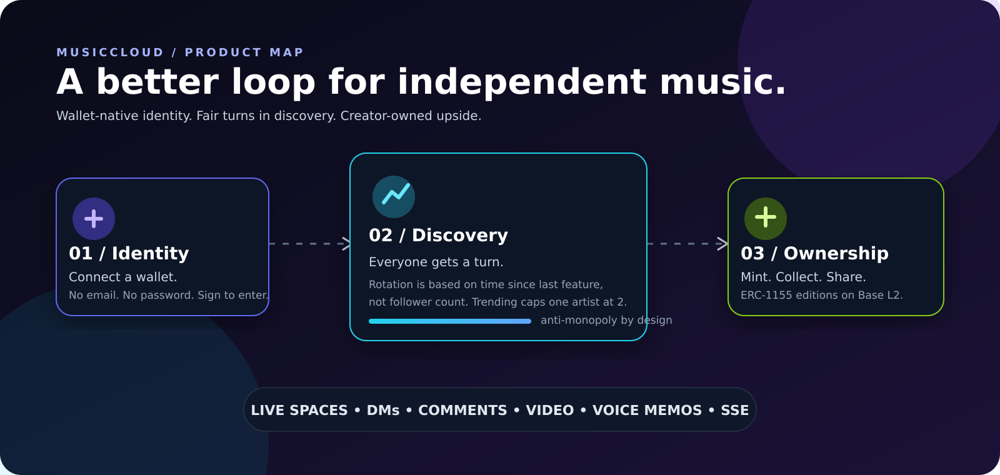
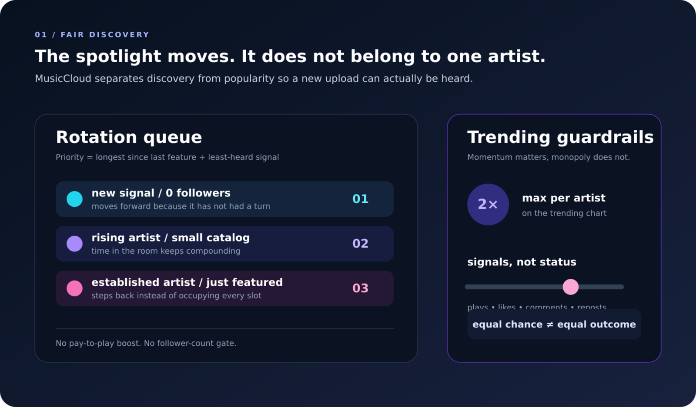
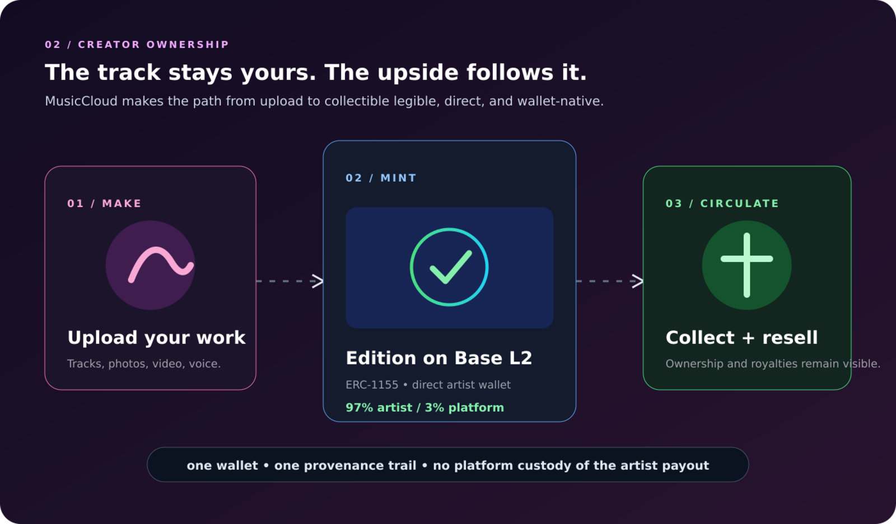
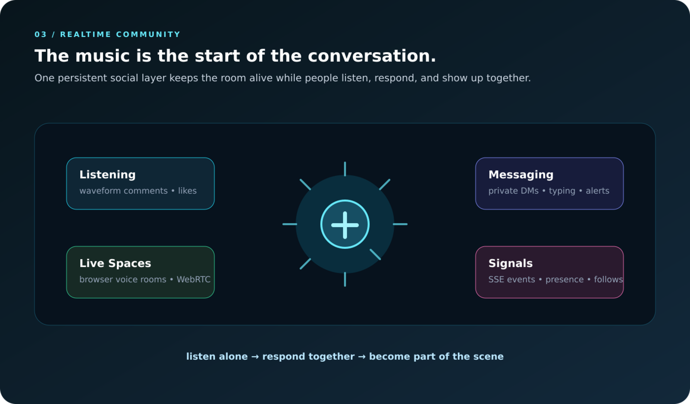
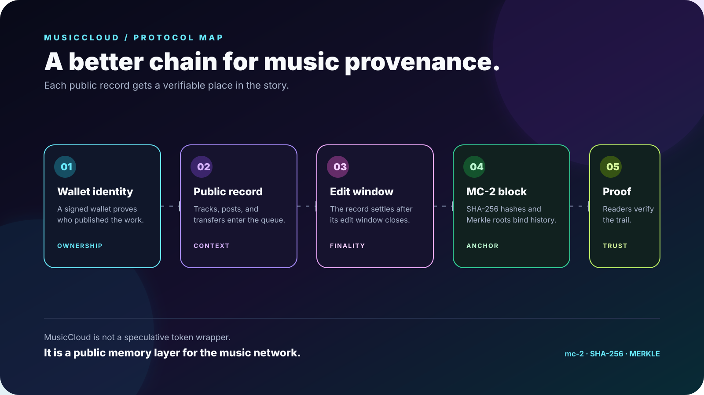

# MusicCloud

> **A fairer home for independent music.** Wallet-native identity, discovery that gives every artist a turn, and creator-owned collectibles on Base L2.

[Open MusicCloud ↗](https://musiccloud.live) · [View the visual showcase ↗](https://thecathousemp3.github.io/musiccloud) · [View the Base contract ↗](https://basescan.org/address/0xbc72d3e4e82a5faa6cd58316c7da1747d82dd019)

## The idea

The best independent music should not need to win a follower-count contest before anyone hears it. MusicCloud turns that frustration into a cleaner loop:

**connect a wallet → publish → get a fair turn → build a real audience → let fans collect the work**

Registration is free. A wallet signature proves account ownership. Pro remains a separate one-time $10 lifetime upgrade for artists who want the full creator toolkit.

## What makes it different

| Surface | The MusicCloud take |
| --- | --- |
| **Discovery** | Rotation prioritizes time since last feature instead of follower count. |
| **Trending** | Plays, likes, comments, and reposts matter—but no artist can hold more than two chart slots. |
| **Ownership** | ERC-1155 editions on Base L2 with direct creator-facing economics. |
| **Identity** | Your EVM wallet is the account. No email/password dependency. |
| **Listening** | Persistent player, waveform seeking, timestamp comments, visualizer energy, and cross-page playback. |
| **Community** | DMs, follows, reposts, live Spaces, voice memos, video, reactions, and realtime notifications. |

## The product story

### 01 — Give the quiet track a chance

Discovery is designed as a rotation, not a popularity wall. Time without exposure is a first-class signal. A new artist with zero followers can enter the room without buying their way in.

### 02 — Keep the creator in the value path

Mint editions directly from the artist profile on Base L2. Keep the economics visible, keep provenance legible, and let collectors carry the story forward.

### 03 — Make the room feel alive

The player, social graph, and live surfaces are not separate islands. Realtime events connect listens to responses, responses to relationships, and relationships to live rooms.

## A quick tour

1. **Enter with a wallet.** Connect an EVM wallet and sign a clear login challenge on Base.
2. **Find something unexpected.** Browse rotation, trending, artist pages, videos, reels, collections, and personalized surfaces.
3. **Stay with the track.** Use the persistent player, waveform, timestamp comments, likes, reposts, and follows.
4. **Join the room.** Message, react, share a voice memo, or open a browser-native live Space.
5. **Collect the moment.** Mint a track, photo, video, or status edition on Base L2 and keep the provenance visible.

## High-level architecture

React/Vite client · Express API · PostgreSQL/Drizzle · Cloudflare R2 media storage · server-sent events · browser WebRTC · wallet signatures verified server-side · Base chain verification.

This public repository is intentionally a **showcase**, not a source-code mirror. It contains the product story, visual explainers, and presentation materials only.

## Snapshot

- **Free** wallet registration with signed ownership proof
- **Base L2** for creator collectibles and transparent provenance
- **97 / 3** primary mint split: artist / platform
- **2-track** artist cap on trending
- **$10 once** for lifetime Pro creator access
- **No application source code** in this public showcase repository

## Live links

- [MusicCloud](https://musiccloud.live)
- [Visual showcase](https://thecathousemp3.github.io/musiccloud)
- [Base contract](https://basescan.org/address/0xbc72d3e4e82a5faa6cd58316c7da1747d82dd019)

---

Built for artists who want a real shot, listeners who want to find something new, and collectors who want the trail to make sense.

**MusicCloud — every artist gets heard.**
## Explore the native blockchain

MusicCloud has a native public chain for provenance, proof, and Music Clouds rewards. This educational showcase explains the protocol without exposing application source code.

[Explore the MusicCloud blockchain ↗](blockchain.html)

