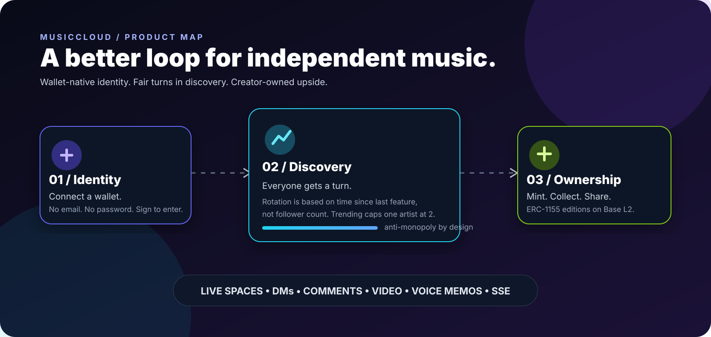
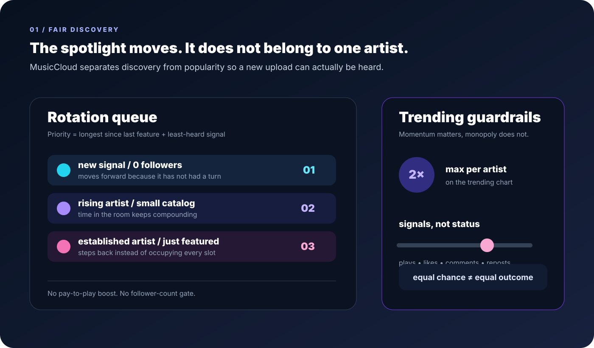
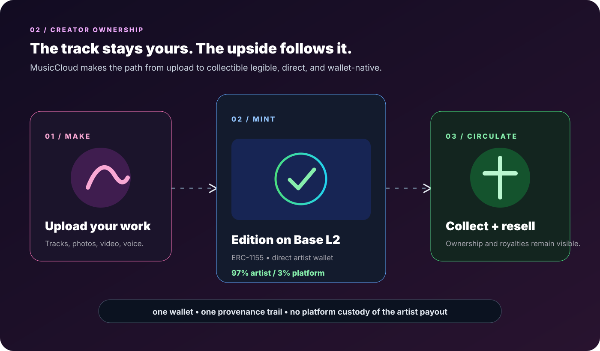
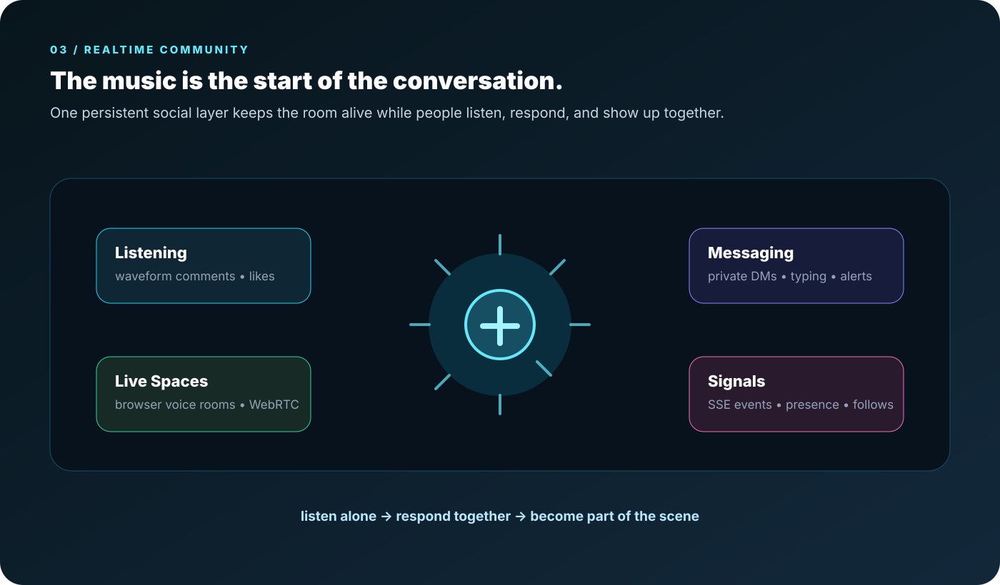

# MusicCloud

    > **A fairer home for independent music.** Wallet-native identity, discovery that gives everyone a turn, and creator-owned collectibles on Base L2.

    

    <a href="https://musiccloudmp3.com"><strong>Open MusicCloud ↗</strong></a> ·
    <a href="https://thecathousemp3.github.io/musiccloud">View the showcase ↗</a> ·
    <a href="https://basescan.org/address/0xbc72d3e4e82a5faa6cd58316c7da1747d82dd019">View the Base contract ↗</a>
    

    

    ## The idea

    MusicCloud is built around a simple frustration: the best independent music should not need to win a follower-count contest before anyone hears it.

    The product turns that frustration into a loop:

    **connect a wallet → publish → get a fair turn → build a real audience → let fans collect the work**

    Registration is free. A wallet signature still proves ownership of the account. Pro is a separate one-time $10 lifetime upgrade for artists who want the full creator toolkit.

    ## What makes it different

    | Surface | The MusicCloud take |
    | --- | --- |
    | **Discovery** | A rotation that prioritizes time since last feature and keeps follower count out of the gate. |
    | **Trending** | Plays, likes, comments, and reposts matter—but no artist can hold more than two chart slots. |
    | **Ownership** | ERC-1155 editions on Base L2, minted from the artist profile with the primary split weighted toward the creator. |
    | **Identity** | Your EVM wallet is the account. No email/password dependency and no opaque identity handoff. |
    | **Listening** | A persistent global player, waveform seeking, timestamp comments, visualizer energy, and cross-page playback. |
    | **Community** | DMs, follows, reposts, live Spaces, voice memos, video, reactions, and realtime notifications. |

    ## Three product principles

    ### 01 — Give the quiet track a chance

    Discovery is designed as a rotation, not a popularity wall. Time without exposure is a first-class signal. A new artist with zero followers can enter the room without buying their way in.

    

    ### 02 — Keep the creator in the value path

    MusicCloud supports direct artist-facing minting and visible on-chain provenance. Collectors can follow an edition from primary mint to resale while the creator-side economics stay explicit.

    

    ### 03 — Make the room feel alive

    The player, social graph, and live surfaces are not separate islands. Realtime events connect listens to responses, responses to relationships, and relationships to live rooms.

    

    ## A quick tour

    1. **Enter with a wallet.** Connect an EVM wallet and sign a human-readable login challenge on Base.
    2. **Find something unexpected.** Browse rotation, trending, artist pages, videos, reels, collections, and personalized surfaces.
    3. **Stay with the track.** Use the persistent player, waveform, timestamp comments, likes, reposts, and follows.
    4. **Join the room.** Message, react, share a voice memo, or open a browser-native live Space.
    5. **Collect the moment.** Mint a track, photo, video, or status edition on Base L2 and keep the provenance visible.

    ## High-level architecture

    The public product is a React/Vite client backed by an Express API, PostgreSQL/Drizzle data, Cloudflare R2 media storage, server-sent events for live updates, and browser WebRTC for Spaces. Wallet ownership is verified server-side with signed challenges; chain actions are verified against Base.

    This repository is intentionally a **showcase**, not a source-code mirror. It contains the product story, visual explainers, and presentation materials only.

    ## Live links

    - **Product:** [musiccloudmp3.com](https://musiccloudmp3.com)
    - **Showcase:** [thecathousemp3.github.io/musiccloud](https://thecathousemp3.github.io/musiccloud)
    - **Base L2 contract:** [0xbc72…dd019 on Basescan](https://basescan.org/address/0xbc72d3e4e82a5faa6cd58316c7da1747d82dd019)

    ## Snapshot

    - **Free** wallet registration with signed ownership proof
    - **Base L2** for creator collectibles and transparent provenance
    - **97 / 3** primary mint split: artist / platform
    - **2-track** artist cap on trending
    - **$10 once** for lifetime Pro creator access
    - **No source code** in this public showcase repository

    ---

    Built for artists who want a real shot, listeners who want to find something new, and collectors who want the trail to make sense.

    **MusicCloud — every artist gets heard.**
    